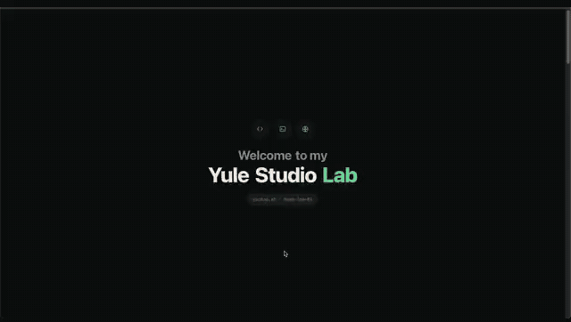

<div align="center">

# hompage

**개인 홈페이지 + 홈랩 포털** — 다크 대시보드 위에 포트폴리오와 홈서버 콘솔을 한 화면으로.

[](https://github.com/yule-studio/hompage/actions/workflows/ci.yml)
[](https://github.com/yule-studio/hompage/actions/workflows/deploy.yml)
[](LICENSE)


</div>

---

## Demo



인트로 → About → Portfolio → Contact 순서로, 사이트를 한 번 훑는 화면이다.

같은 녹화본을 화면 단위로 잘라 프로젝트 카드 안에서도 재생한다 — 카드가 띠를 타고
한 칸씩 넘어가면서 가운데 카드만 크게 재생되고, 양옆은 작은 카드로 남는다. 자르는
방법과 타임코드는 [`docs/demo-clips.md`](docs/demo-clips.md) 에 있다.

| 원본 화질 | |
| --- | --- |
| [`01 Intro`](public/media/demo/hompage-intro.mp4) | 로딩 시퀀스에서 히어로까지 |
| [`02 About`](public/media/demo/hompage-about.mp4) | 프로필 · 활동 이력 · 활동 상세 팝업 |
| [`03 Portfolio`](public/media/demo/hompage-portfolio.mp4) | 포스터 그리드에서 프로젝트 상세까지 |
| [`04 Contact`](public/media/demo/hompage-contact.mp4) | 문의 폼 + 코멘트 월 |

## Overview

한 페이지짜리 스크롤 내러티브다. 히어로가 먼저 오고, 그 아래로 About · Portfolio ·
Contact 가 이어지며, 각 구역은 화면에 들어올 때 순서대로 나타난다. 프로젝트만
자기 상세 페이지를 따로 가진다.

- **다크 테마 기본** · 도트 그리드 배경 · 초록색 accent, 라이트 토글 (flash 방지)
- **얇은 border / 작은 mono 라벨 / muted text** — 포트폴리오 + 홈랩 콘솔 조합
- **full-bleed 포스터 그리드** — 프로젝트 · 자격증 · 기술 · 홈랩을 같은 카드 문법으로
- **외부 CDN 의존 0** — 폰트 / 아이콘 모두 system stack + inline SVG
- **GitHub 이 데이터 소스** — 프로젝트 · 언어 · 토픽 · 통계를 스크립트로 당겨 커밋

## Routes

| route | summary |
| --- | --- |
| `/` | 한 페이지 — Hero → About → Portfolio → Contact |
| `/projects/:slug` | 프로젝트 상세 — GitHub README 렌더 |
| `*` | 404 |

한 페이지 안의 구역:

| 구역 | 내용 |
| --- | --- |
| **Hero** | 이름 · 한 줄 소개 · 외부 링크 · 흔들리는 사원증 (react-three-fiber + rapier) |
| **About** | 프로필 · 이력서 / 포트폴리오 PDF · 주요 활동 이력 (클릭 시 상세 팝업) |
| **Portfolio** | 탭 4 개 — Projects / Certificates / Tech Stack / Homelab, 전부 포스터 그리드 |
| **Contact** | 문의 폼 + 코멘트 월 |

`#about` `#portfolio` `#homelab` `#contact` 앵커로 바로 들어올 수 있다. `#homelab`
은 Portfolio 안 홈랩 탭을 열어준다.

## Data

`src/data/*.ts` 가 화면의 유일한 입력이다. 두 종류로 나뉜다.

**손으로 쓰는 것** — 코드 변경 없이 배열에 한 줄 추가하면 그대로 붙는다.

| file | 쓰이는 곳 |
| --- | --- |
| `profile.ts` | Hero · About |
| `activities.ts` | About 활동 이력 (`detail` 이 있으면 팝업이 열린다) |
| `certs.ts` `skills.ts` `awards.ts` | Portfolio 탭 |
| `homelab.ts` | Homelab 탭 — 호스트 · 서비스 |
| `projectDemos.ts` | 프로젝트 카드 안에서 도는 시연 클립 |
| `posts.ts` `events.ts` `planSnapshot.ts` | 글 · 일정 · 계획 |

**동기화되는 것** — `npm run github:*` / `npm run blog:sync` 가 덮어쓴다. 직접 고치면
다음 동기화에서 사라진다.

| file | 스크립트 |
| --- | --- |
| `projects.ts` | `npm run github:projects` |
| `githubStats.ts` | `npm run github:stats` |
| `githubLanguages.ts` | `npm run github:languages` |
| `githubTopics.ts` | `npm run github:topics` |
| `blog.ts` | `npm run blog:sync` |

시연 클립이 `projects.ts` 가 아니라 `projectDemos.ts` 에 사는 것도 같은 이유다 —
전자는 동기화 대상이라 적어넣은 것이 지워진다.

## Quick start

```bash
git clone https://github.com/yule-studio/hompage.git
cd hompage
npm install
npm run dev        # http://localhost:5173
```

다른 스크립트:

```bash
npm run build      # 정적 빌드 → dist/
npm run preview    # 빌드 결과 로컬 서빙 (http://localhost:4173)
npm run lint       # ESLint (--max-warnings 0)
npm run typecheck  # tsc -b --noEmit
```

요구 사항: **Node 20+**, npm 10+.

## Directory layout

```
.
├── docs/
│   ├── demo-clips.md          시연 클립 재단 방법 + 타임코드
│   └── media/                 README 용 GIF / 스틸
├── public/
│   ├── assets/                본문 사진 · 도면
│   ├── docs/                  포트폴리오 PDF
│   └── media/                 시연 녹화본
│       └── demo/              화면 단위로 자른 클립 + 포스터 프레임
├── private/                   저장소에 올리지 않는 원본 (이력서 PDF)
├── scripts/                   GitHub / 블로그 동기화 (node, CI 밖에서 수동 실행)
├── src/
│   ├── components/
│   │   ├── Layout/ Topbar/ Navigation/     껍데기 + 스크롤 내비
│   │   ├── Intro/ Background/ WalkingCat/  로딩 시퀀스 · 도트 배경 · 장식
│   │   ├── Hero/ Band/ ProfileCard/        히어로 + 물리 사원증
│   │   ├── About/                          프로필 · 활동 이력 · 상세 팝업
│   │   ├── Showcase/                       포스터 그리드 (탭 4 개 + 시연 카드)
│   │   └── Card/ SectionHeader/ StatusBadge/ TerminalCard/
│   ├── pages/
│   │   ├── Home/              한 페이지 스크롤
│   │   ├── Projects/          프로젝트 상세 (README 렌더)
│   │   ├── Contact/           문의 폼 + 코멘트 월
│   │   └── NotFound.tsx
│   ├── data/                  화면의 유일한 입력 — 위 Data 절 참고
│   ├── hooks/                 데이터 fetch · 스크롤 리빌 · 클립 재생
│   ├── lib/                   이력서 발급 · 코멘트 API 클라이언트
│   ├── styles/                tokens / globals / layout (CSS only — no Tailwind)
│   ├── App.tsx                라우팅 + 인트로
│   └── main.tsx               엔트리
├── .github/workflows/         ci.yml · deploy.yml
├── index.html                 인라인 theme bootstrap (flash 방지)
└── vite.config.ts
```

## Design tokens

`src/styles/tokens.css` 가 단일 진실의 원천 (SSoT).

```css
/* core */
--bg / --bg-elevated / --bg-card / --bg-pill        /* surface */
--text / --text-muted / --text-faint / --text-inverse
--border / --border-strong / --border-accent
--accent (#4ade80) / --accent-soft / --accent-strong

/* status */
--ok / --warn / --err / --info

/* spacing */
--space-1 .. --space-10
--radius-sm/md/lg/pill

/* type */
--font-sans / --font-mono / --text-xs..3xl / --tracking-mono / --tracking-label

/* layout */
--container-max (1180px) / --container-pad / --edge / --topbar-h / --nav-h
--dot-color / --dot-size / --dot-spacing            /* dot grid bg */
```

테마 전환은 `<html data-theme="light">` 또는 `"dark"`. `Topbar` 가
`localStorage["yule.theme"]` 에 보존한다.

## 시연 클립이 카드 안에서 도는 방식

프로젝트 카드는 녹화본을 그냥 틀지 않는다. 화면 단위로 자른 클립을 각각 하나의
카드로 만들어 띠에 꿰고, 가운데 카드만 크게 재생한다.

- 클립이 끝나면 띠가 한 칸 이동한다. 재생하던 카드는 작아지고 다음 카드가 커진다.
- 카드마다 열리는 모서리가 다르다 (`GROW_FROM`) — 전부 가운데서 커지면 메트로놈처럼 보인다.
- 띠는 같은 구간을 3 번 이어 붙여두고, 한 바퀴 지난 지점에서 트랜지션을 끈 채 한 바퀴만큼
  되감는다. 화면에 보이는 것이 양쪽에서 완전히 같으므로 되감기가 보이지 않고, 띠는 한
  방향으로만 흐른다.
- 화면에 들어온 카드만 로드하고 재생한다 (`preload="none"` + IntersectionObserver).
- 녹화가 읽는 속도라 썸네일 크기에서는 빨라서, `rate` 로 0.85 배로 재생한다.

프로젝트에 클립을 붙이려면 `src/data/projectDemos.ts` 에 slug 로 한 항목 추가하면
된다. `sections` 가 없으면 녹화본 전체를 창 하나로 반복 재생한다.

## 외부 서비스

브라우저에 토큰을 두지 않기 위해 두 가지는 별도 서비스가 처리한다 — 둘 다
[`yule-studio/hompage-comments`](https://github.com/yule-studio/hompage-comments).

- **코멘트 월** — GitHub 이슈로 저장. 쓰기 토큰은 서버에만 있다.
- **이력서 발급** — 이력서에는 전화번호가 들어가서 정적 파일로 두지 않는다. 요청마다
  마스킹 + 일련번호를 찍은 사본을 서버가 만든다 (`src/lib/resume.ts`).

서비스가 꺼져 있으면 두 기능만 비활성으로 표시되고 사이트는 그대로 뜬다.

## Accessibility

- semantic HTML — `<header>` `<nav aria-label="Primary">` `<main>` `<footer>` `<article>`
- skip link — Tab 첫 입력 시 "본문으로 건너뛰기"
- focus state — 전역 `:focus-visible { outline: 2px solid var(--accent) }`
- aria-label — 아이콘 버튼 / nav / card
- color-only 의존 X — status 는 dot + label 동시
- `prefers-reduced-motion` — 인트로 · 리빌 · 시연 클립 · 광택 전부 정지

## CI / CD

- **`ci.yml`** — `npm ci` → `lint` → `typecheck` → `build`. PR 과 main push 모두 실행.
  main push 시 `dist/` artifact 업로드 (7 day).
- **`deploy.yml`** — main push 시 GitHub Pages 배포. 첫 배포 전 repo Settings → Pages →
  Source 를 **GitHub Actions** 로 변경 필요.

GitHub / 블로그 동기화 스크립트는 CI 에 없다. 손으로 돌리고 결과를 커밋한다 — 빌드가
외부 API 상태에 묶이지 않게 하기 위해서다.

## Adding content

1. `src/data/<category>.ts` 의 export 배열에 한 항목 추가.
2. 컴포넌트 / 페이지 코드 변경 0 — 자동 반영.
3. `npm run dev` 로 확인 후 PR.

동기화되는 파일 (`projects.ts` 등) 은 직접 고치지 말고 해당 스크립트를 돌린다.

## Contributing

이 레포는 1 인 개인 사이트지만 PR 환영. 다음을 지켜주세요.

- 한국어 commit 메시지 + gitmoji + `변경 이유 / 주요 변경 사항 / 비고` 3 섹션
- PR 본문은 `.github/PULL_REQUEST_TEMPLATE.md` 의 섹션을 따라
- `npm run lint && npm run typecheck && npm run build` 모두 통과해야 review

## License

MIT — [LICENSE](LICENSE).
